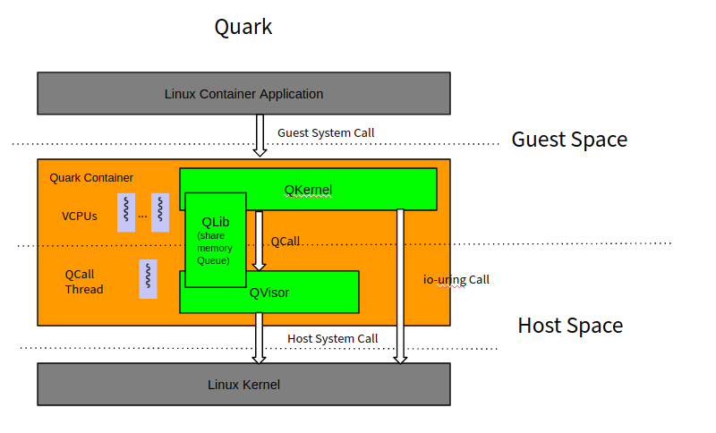
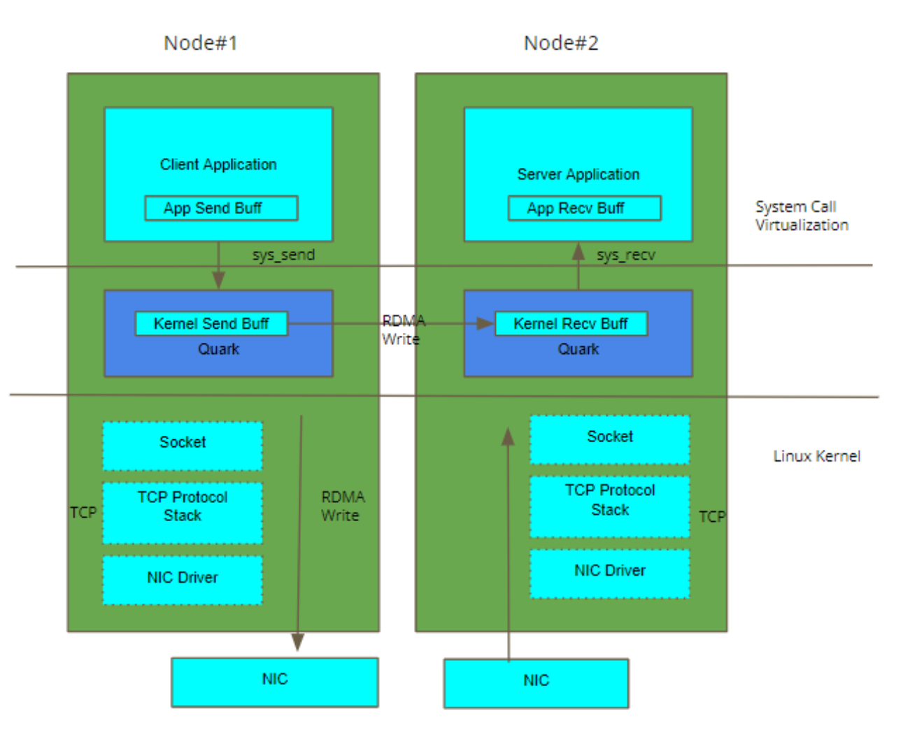

# Quark Container
Welcome to Quark Container.

This repository is the home of Quark Containers code.

## What's Quark Container

Quark Container is high performance secure container runtime with following
features: 
1. OCI compatible: Quark Container includes an Open Container Initiative (OCI)
   interface. Common Docker container image can run in Quark Container.
2. Secure: It provides Virtual Machine level workload isolation and security.
3. High Performance: Quark Container is born for container workload execution
   with high performance. It is developed with the Rust programming language. 


## Performance test 

The performance slices is [performance.pdf](doc/performance.pdf). The detail
test steps and result is [here](doc/perf_test.md)

## Architecture

Quark Container takes classic Linux Virtual Machine architecture as below. It
includes an HyperVisor named QVisor and a guest kernel named QKernel. Unlike the
common Linux Virtual Machine design, in which standard OS image such as
Linux/Windows can run on Qemu. QVisor and QKernel are tightly coupled. QVisor
only supports QKernel.


Quark Container's high level design is as below. It handles Container
Application request with following steps.
1. Container Application System Call: In Quark Container, Container Application
   run as a Guest Application. And it sends request to Quark through Guest
   System Call, e.g. X86-64 SysCall/SysRet.
2. Host System Call: From Host OS perspective, Quark is running as a common
   Linux application. When Quark gets Guest System Call, it will explained that
   in the Quark runtime. If it needs to access the host system, e.g. read host
   file, it will call Host OS through Host System Call.
3. QCall: For the communication between Guest Space and Host Space, QKernel
   doesn't call QVisor through HyperCall directly as common Virtual Machine
   design. Instead, it sends request to QVisor through QCall, which is based on
   Share memory queue. There is a dedicated QCall handing thread waiting in Host
   Space to process QCall request. Based on that, VCPU thread's high cost
   Guest/Host switch is avoid. For the host IO data operation, such as socket
   read/write, Qkernel will call the Host Kernel directly with IO-Uring, which
   could bypass QVisor to achieve better performance. (Note: IO-Uring won't
   handle IO control operation, such as Open, for security purpose)



## TCP Socket over RDMA (TSoR)
Quark Container supports to transfer the container application's TCP traffic
with RDMA connection, i.e. TSoR. TSoR is a container network provider in K8S
cluster and the existing TCP based container application can transfer data
through RDMA without ANY modification. As TSoR offloads the TCP/IP protocol
stack workload to RDMA NIC. It can achieve higher throughput, low latency with
less CPU footprint. The [TSOR test result](doc/TSoR.xlsx) is the Redis benchmark
test result with comparison between Quark + TSoR and RunC + Flannel. TSoR
shows 5 times throughput improvement over Flannel. The TSoR architecture is as
below. The introduction is [here](doc/TSoR.pptx)



## System Requirement
1. OS: Linux Kernel > 5.8.0
2. Processor: X86-64/Amd64 or aarch64 (see notes below).
3. Docker: > 17.09.0
4. Enable virtualization technology in BIOS (Usually in Security tab of BIOS)

Quark primarily supports X86-64. aarch64 support is preliminary and under active
development. Other architecture will be available in the future.

## Installing from source

### Dependencies and rust toolchain

Quark is developed with Rust language. The build needs to install Rust nightly.
Please use current known good version
`nightly-2023-12-11-x86_64-unknown-linux-gnu` (replace `x86_64` with `aarch64`
for the aarch64 build)

```sh
rustup toolchain install nightly-2023-12-11-x86_64-unknown-linux-gnu
rustup default nightly-2023-12-11-x86_64-unknown-linux-gnu
```

Add the rust-src component to the current toolchain:
```sh
rustup component add rust-src
```

And install "cargo-xbuild" for qkernel cross compilation
```sh
cargo install cargo-xbuild
```

Install libcap library
```sh
sudo apt-get install libcap-dev
```

Also, some extra libraries for compiling RDMA module:
```sh
sudo apt-get install build-essential cmake gcc libudev-dev libnl-3-dev \
libnl-route-3-dev ninja-build pkg-config valgrind python3-dev cython3 \
python3-docutils pandoc libclang-dev
```

And also some extra libraries for compiling GPU module:  
(Please note, you can execute following commands even in non nvidia machine to
get ability for compiling GPU module.)
```sh
sudo apt-get install libelf-dev nvidia-driver-535
```

### Build Quark
```sh
git clone git@github.com:QuarkContainer/Quark.git
cd Quark
make
make install
```

#### Build with GPU module
```sh
make cuda_all
make install
```

#### Install / Setup / Configuration
1. Install binary: Quark has 2 binaries: "quark" and "qkernel.bin". Both of them
   was copied to /usr/local/bin/ folder when running `make install`. "quark"
   contains QVisor code and it also implement the OCI interface.
2. Setup Docker: To enable Docker to run container with Quark Container,
   "/etc/docker/daemon.json" needs to be updated. Example is as
    [daemon.json](doc/daemon.json)
3. Create log folder
    ```sh
    sudo mkdir /var/log/quark
    ```
5. Restart Docker: After the "/etc/docker/daemon.json" is updated, The Docker
   daemon restart is need to enable the configuration change
    ```sh
    sudo systemctl restart docker
    ```

#### Hello world: 

The hello-world docker sample application can be executed as below:
```sh
sudo systemctl restart docker
sudo systemctl restart docker.service
docker run --rm --runtime=quark hello-world
```      
    
## Configuration
Quark Container's configuration file is at [/etc/quark/config.json](config.json)
. Configuration detail is TBD...

## Debug and Log
Quark Container's debug log is put in /var/log/quark/quark.log. It could enable
or disable by "DebugLevel" of [/etc/quark/config.json](config.json). There are 5
possible value of "DebugLevel" as below.
```
Off,
Error,
Warn,
Info,
Debug,
Trace,
```
    
When log is enabled, e.g. Debug. After run a docker image with Quark Container,
the logs will be generated in the /var/log/quark/quark.log. See the
[wiki](https://github.com/QuarkContainer/Quark/wiki) for further debugging tips.

## k8s set up and use TCP over RDMA
Please refer to [this link](doc/k8s_setup.md) to set up k8s using quark
container and RDMA support.

## aarch64 support
Quark now has preliminary aarch64 support (still under active development).

**Notes on newer arm64 architectures**:  

newer arm64 architectures add PAN (Privilege Access Never) bit in the pstate
which prevents the kernel (el1) from accessing user (el0) memory. Full support
is WIP. As a temporary workaround we simply clear the PAN in the qkernel. To do
this, you need to manually apply
[this patch](https://lists.sr.ht/~quark/QuarkContainer/patches/51839)

## Communications
- use the [Quark mailing list](https://lists.sr.ht/~quark/QuarkContainer) by
  simply sending emails to `~quark/QuarkContainer@lists.sr.ht`. To subscribe to
  the list, send an empty email to `~quark/QuarkContainer+subscribe@lists.sr.ht`
  To learn more about using mailinglist, see the [Mailing list etiquette](https://man.sr.ht/lists.sr.ht/etiquette.md).
- there is also a [Slack channel](https://join.slack.com/t/quarksoftgroup/shared_invite/zt-oj7dgqet-6iUXmOnMbqHj4g_XAd_3Mg)
