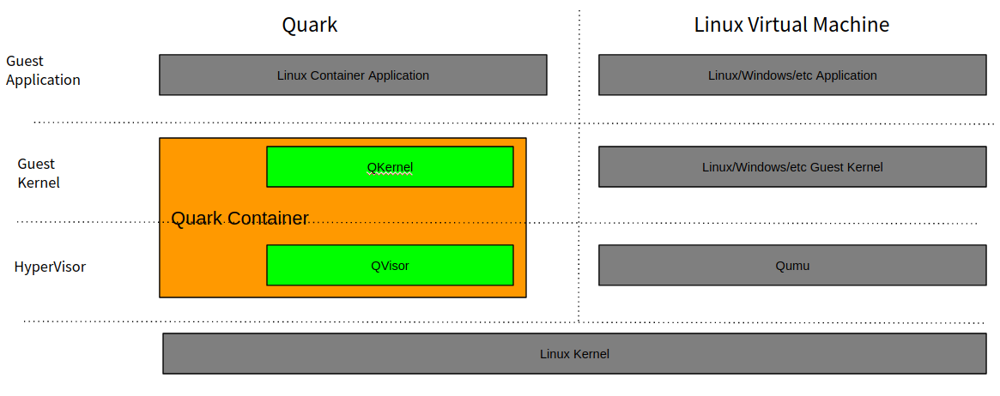

# Quark Container
Welcome to Quark Container.

This repository is the home of Quark Containers code.

## What's Quark Container

Quark Container is high performance secure container runtime with following features: 
1. OCI compatible: Quark Container includes an Open Container Initiative (OCI) interface. Common Docker container image can run in Quark Container.
2. Secure: It provides Virtual Machine level workload isolation and security.
3. High Performance: Quark Container is born for container workload execution with high performance. It developed with Rust language. 

## Architecture

Quark Container takes classic Linux Virtual Machine architecture as below. It includes an HyperVisor named QVisor and a guest kernel named QKernel. Unlike the common Linux Virtual Machine design, in which standard OS image such as Linux/Windows can run on Qumu. QVisor and QKernel are tightly coupled. QVisor only supports QKernel.

Quark Container's high level design is as below. It handles Container Application request with following steps.
 1. Container Application System Call: In Quark Container, Container Application run as a Guest Application. And it sends request to Quark through Guest System Call, e.g. X86-64 SysCall/SysRet.  
 2. Host System Call: From Host OS perspective, Quark is running as a common Linux application. When Quark gets Guest System Call, it will explained that in the Quark runtime. If it needs to access the host system, e.g. read host file, it will call Host OS through Host System Call.
 3. QCall: For the communication between Guest Space and Host Space, QKernel doesn't call QVisor through HyperCall directly as common Virtual Machine design. Instead, it sends request to QVisor through QCall, which is based on Share memory queue. There is a dedicated QCall handing thread waiting in Host Space to process QCall request. Based on that, VCPU thread's high cost Guest/Host switch is avoid. For the host IO data operation, such as socket read/write, Qkernel will call the Host Kernel direclty with IO-Uring, which could bypass QVisor to achieve better performance. (Note: IO-Uring won't handle IO control operation, such as Open, for security purpose)

## System Requirement
1. OS: Linux Kernel > 5.8.0
2. Processor: X86-64 (Quark only support 64 bit architecture, So far only support Intel CPU)
3. Docker: > 17.09.0

## Installing from source

### Requirement 
Quark builds on X86-64 only. Other architecture will be available in the future.

Quark is developed with Rust language. The build OS needs to install Rust nightly. 

### Build
    git clone git@github.com:QuarkContainer/Quark.git
    cd Quark
    make
    make install

### Install / Setup / Configuration
1. Install binary: Quark has 2 binaries: "quark" and "qkernel.bin". Both of them was copied to /usr/local/bin/ folder when running "make install". "quark" contains QVisor code and it also implement the OCI interface.
2. Setup Docker: To enable Docker to run container will Quark Container running, "/etc/docker/daemon.json" needs to be updated. Example is as 
3. Restart Docker: Docker daemon restart is need to enable the configuration change
    sudo systemctl restart docker

### Helloworld
The helloworld docker sample application can be executed as below.
    docker run --rm --runtime=quark hello-world