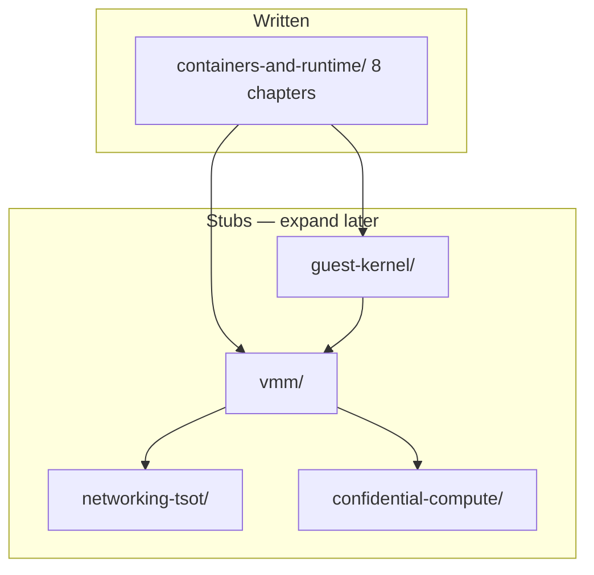

# Quark architecture documentation

Human-readable system documentation for engineers. This folder is the **canonical place** for how Quark is designed and how the pieces fit together.

Operational bug notes live in [`kdoc/bugs/`](../bugs/). Lab runbooks live in [`kdoc/ops/`](../ops/). Kubernetes install steps stay in [`doc/k8s_setup.md`](../../doc/k8s_setup.md).

---

## Documentation map

---

## Reading guide

| If you want to understand… | Start here |
|----------------------------|------------|
| OCI, runc, shim, containerd | [`containers-and-runtime/02-oci-runtime-spec.md`](containers-and-runtime/02-oci-runtime-spec.md) |
| Full container/CRI path | [`containers-and-runtime/README.md`](containers-and-runtime/README.md) |
| How Quark differs from runc | [`containers-and-runtime/06-quark-runc-internals.md`](containers-and-runtime/06-quark-runc-internals.md) |
| CRI pods on Kubernetes | [`containers-and-runtime/07-cri-pod-lifecycle.md`](containers-and-runtime/07-cri-pod-lifecycle.md) |
| Guest kernel (qkernel) | [`guest-kernel/README.md`](guest-kernel/README.md) *(stub)* |
| Host VMM (KVM, vmspace) | [`vmm/README.md`](vmm/README.md) *(stub)* |
| TSOT networking | [`networking-tsot/README.md`](networking-tsot/README.md) *(stub)* |
| Confidential compute | [`confidential-compute/README.md`](confidential-compute/README.md) *(stub)* |
| A fixed regression | [`kdoc/bugs/`](../bugs/) |

---

## Subfolders

| Folder | Status | Contents |
|--------|--------|----------|
| [`containers-and-runtime/`](containers-and-runtime/) | **Complete** (v1) | 8 chapters, tables + mermaid throughout |
| [`guest-kernel/`](guest-kernel/) | Stub | qkernel, scheduler, syscalls |
| [`vmm/`](vmm/) | Stub | KVM, VMSpace, kvm_vcpu |
| [`networking-tsot/`](networking-tsot/) | Stub | TSOT, qservice, Group B |
| [`confidential-compute/`](confidential-compute/) | Stub | `CCMode`, `vm_type/*` |

---

## How this stays current

Doc updates follow [`.cursor/rules/architecture-docs.mdc`](../../.cursor/rules/architecture-docs.mdc): propose changes after big architectural shifts or when docs drift from code; get human approval before editing.

---

## Related (not duplicated here)

| Doc | Role |
|-----|------|
| [`kdoc/future-plans.md`](../future-plans.md) | Forward-looking checklist (storage, TSOT, CRI follow-ups) |
| [`doc/k8s_setup.md`](../../doc/k8s_setup.md) | Install quark + containerd on a node |
