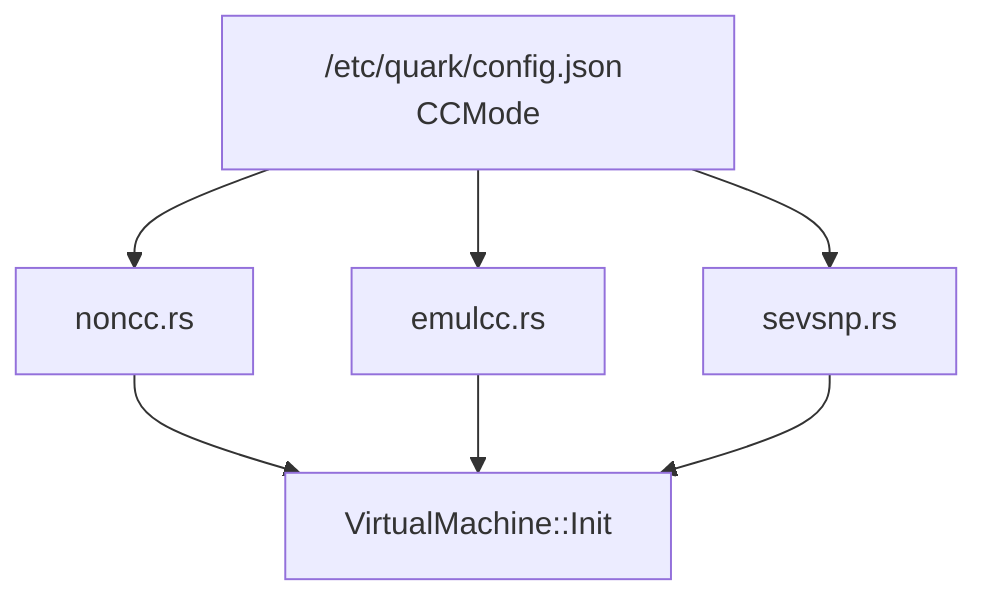

# Confidential compute — stub

> **Status:** Stub — full chapter not written yet.  
> **Code:** `qvisor/src/runc/runtime/vm_type/`, `qlib/config.rs` `CCMode`

## What this doc will cover

| Topic | Why it matters |
|-------|----------------|
| `CCMode` values | `None`, emulated CC, SEV-SNP paths |
| `vm_type/noncc.rs` | Default KVM micro-VM (CRI today) |
| `vm_type/emulcc.rs` | Emulated confidential container mode |
| `vm_type/sevsnp.rs` | AMD SEV-SNP hardware path |
| Boot & attestation | What changes in loader, memory encryption |
| Feature gating | Cargo features, aarch64/SNP `todo!()` surfaces |

## Mode matrix (preview)

| `CCMode` | Module | Typical use |
|----------|--------|-------------|
| `None` | `noncc.rs` | Standard lab / CRI |
| Emulated CC | `emulcc.rs` | Dev/test without SNP hardware |
| SEV-SNP | `sevsnp.rs` | Confidential VMs on AMD |

## Entry points to read today

| File | Role |
|------|------|
| `qvisor/src/runc/runtime/vm_type/noncc.rs` | Default; Sandboxed vCPU rules |
| `qvisor/src/runc/runtime/vm_type/emulcc.rs` | Emulated CC |
| `qvisor/src/runc/runtime/vm_type/sevsnp.rs` | SEV-SNP |
| `qvisor/src/runc/runtime/loader.rs` | Boot args from OCI resources |

## See also

- [Quark runc internals](../containers-and-runtime/06-quark-runc-internals.md) — VM boot overview
- [future-plans.md](../../future-plans.md) — repo hygiene, SEV feature gating notes

---

*Approve expansion via [architecture-docs rule](../../../.cursor/rules/architecture-docs.mdc).*
