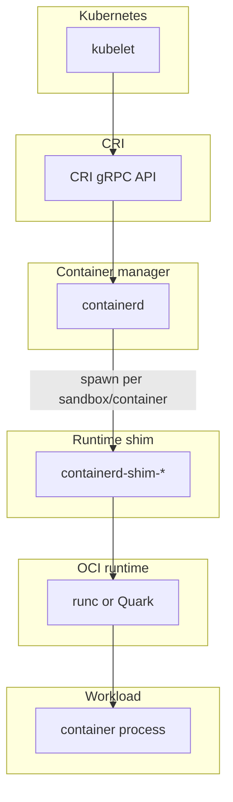
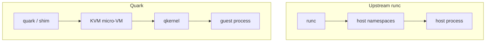

# 1. The layered container stack

Before opening Quark’s source, it helps to see where each layer sits. A typical Kubernetes node does **not** run your container process directly from the kubelet.

## The chain

On a classic Docker setup the names differ (`dockerd` instead of kubelet, older shim layout), but the **idea** is the same: each layer has a narrow job, and the layer below it can be swapped (runc vs Kata vs Quark).

## What each layer is responsible for

### kubelet

The node agent. It decides *which* pods and containers should run on this machine, pulls images (via CRI), creates sandboxes and containers, wires networking and volumes at the pod level, and reports status back to the API server. It does **not** fork your application binary itself.

### containerd (container manager)

A long-lived daemon. It holds images, snapshotters, and runtime plugins. For CRI it implements the **Runtime Service** and **Image Service**. When kubelet asks for a pod sandbox or container, containerd picks a **runtime handler** (e.g. `quark`, `kata`) and starts the corresponding **shim** process.

### container runtime shim

A **per-sandbox or per-container** helper that outlives individual manager RPCs. It sits between containerd and the low-level runtime. We cover shims in depth in [chapter 4](04-what-shim-does.md).

Quark installs as `containerd-shim-quark-v1` — the same `qvisor` binary as the `quark` CLI, only invoked under a different name (see [chapter 5](05-quark-binary-entry.md)).

### OCI runtime (runc, crun, Quark, …)

Implements the [OCI Runtime Specification](https://github.com/opencontainers/runtime-spec): given a **bundle** (`config.json` + `rootfs`), create an isolated process with namespaces, cgroups, mounts, and capabilities. **Upstream runc** does this with `fork`/`exec` on the host.

**Quark** implements the same OCI *interface* but boots a **KVM micro-VM** and runs the workload inside **qkernel** (guest Linux). From containerd’s perspective it still looks like a runtime + shim; the isolation mechanism is different.

### Container process

The first process in the container’s PID namespace (often PID 1 inside the namespace). In runc that is a normal host process in new namespaces. In Quark it is a process **inside the guest kernel**, controlled via a host↔guest control channel (ucall).

## Two different “runtimes” people mean

| Term | Meaning |
|------|---------|
| **High-level runtime** | containerd, CRI-O, Docker Engine — image + lifecycle orchestration |
| **Low-level / OCI runtime** | runc, Quark, Kata’s hypervisor path — actually creates the isolated execution environment |

Quark spans both worlds: it is an OCI runtime **and** ships a containerd v2 shim in the same binary.

## How this maps to Quark artifacts

| Artifact | Role |
|----------|------|
| `quark` | CLI for direct OCI (`create`, `start`, `run`, `exec`, …) |
| `containerd-shim-quark-v1` | Same binary; argv0 triggers shim + Task API |
| `qvisor boot` | Internal entry: child process that owns the VMM (not used by operators directly) |
| `qkernel.bin` | Guest kernel loaded into the VM |
| `/etc/quark/config.json` | Host/guest behavior (`Sandboxed`, cgroups, io_uring, …) |

## runc vs Quark at this layer

| | runc | Quark |
|--|------|-------|
| Isolation boundary | Host kernel namespaces | Guest VM |
| Process you `ps` on host | Container workload | VMM + `quark boot` child |
| Workload PID 1 | In container namespace on host | Inside guest |

## Next

[Chapter 2 — OCI standards](02-oci-runtime-spec.md): bundles, `config.json`, and the image/runtime split.

Then [chapter 3 — What runc does](03-what-runc-does.md): foreground vs detached, and why detached mode exists.
