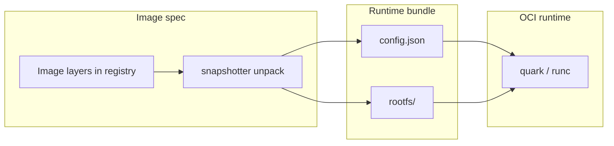
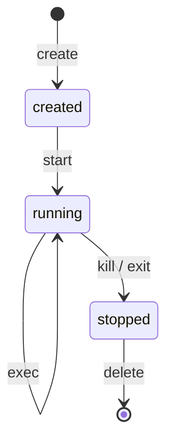

# 2. The OCI standards

Almost everything below Quark in the stack speaks **OCI** — the [Open Container Initiative](https://opencontainers.org/) specifications. If you have only used `docker run`, this chapter explains the contracts our `runc/` code implements and what containerd hands us on each `Task.Create`.

**Official specs:**

- [OCI Runtime Specification](https://github.com/opencontainers/runtime-spec/blob/main/spec.md) — how to run an isolated process from a bundle
- [OCI Image Specification](https://github.com/opencontainers/image-spec/blob/main/spec.md) — how images are named, layered, and configured

runc, crun, Kata, and Quark are **OCI runtimes** (they consume runtime bundles). containerd implements **image** unpacking and produces bundles for the runtime.

---

## Image spec vs runtime spec

| Spec | Question it answers | Typical artifact |
|------|---------------------|------------------|
| **Image** | What is in the image? How are layers stored? | `manifest.json`, `config.json` (image config), layer tarballs |
| **Runtime** | How do I start an isolated process from a rootfs + config? | **Bundle**: `config.json` + `rootfs/` directory |



containerd pulls an image (image spec), unpacks it into a snapshot, assembles an OCI **runtime** `config.json` for that container, and points the runtime at the bundle directory. Quark never talks to a registry directly in the CRI path — containerd does.

---

## The runtime bundle

A **bundle** is a directory on disk:

```text
/run/containerd/io.containerd.runtime.v2/task/<namespace>/<id>/
  config.json       # OCI runtime spec for this container instance
  rootfs/           # often a mount; visible filesystem tree for /
  (optional)        # state, logs, sockets — runtime-specific
```

### `config.json` — the runtime spec

One JSON document describes **one container instance**. Important top-level sections:

| Section | Purpose |
|---------|---------|
| `ociVersion` | Spec version (e.g. `1.0.2`) |
| `process` | User, args, env, cwd, `terminal`, `capabilities`, rlimits |
| `root` | `path` to rootfs (usually `rootfs`), `readonly` |
| `mounts` | Additional bind mounts, tmpfs, proc, sysfs, … |
| `linux` | Namespaces, cgroups path, resources (CPU, memory), seccomp, devices |
| `hooks` | `prestart`, `createRuntime`, `poststart`, `poststop` — host commands at lifecycle points |
| `annotations` | Opaque key/value — **CRI and containerd put critical metadata here** |

Generate a minimal bundle with upstream runc:

```bash
mkdir -p mybox/rootfs
# populate rootfs (e.g. export from an image)
runc spec -b mybox
```

Quark’s types live in `qvisor/src/runc/oci/mod.rs` (railcar lineage). CLI and shim both deserialize the same structures.

### `rootfs/`

The filesystem tree that becomes `/` inside the container after pivot/root mount. In Quark’s **guest** model, this tree is what the guest kernel mounts at `/{containerId}` (see [chapter 6](06-quark-runc-internals.md)) — the OCI contract is the same; the isolation boundary is a VM instead of host namespaces.

---

## Lifecycle operations (runtime spec)

The OCI runtime spec defines standard operations. Names map directly to runc CLI and to what shims implement:

| Operation | Meaning |
|-----------|---------|
| **create** | Allocate state, set up namespaces/cgroups/mounts; user process may not run yet |
| **start** | Run the configured `process.args` |
| **run** | create + start (convenience) |
| **kill** | Send signal |
| **delete** | Destroy container state after stopped |
| **exec** | Start an additional process in existing container |
| **state** | Query status JSON (`running`, `stopped`, `pid`, …) |

**Detached lifecycle** (what containerd uses):



CRI’s `crictl create` / `crictl start` mirror this split ([chapter 3](03-what-runc-does.md)).

### `state.json`

runc writes container state under the bundle (path varies by version). Fields include `status`, `pid`, `bundle`, `rootfs`. Shims and debugging tools read this; Quark persists similar metadata via `Container` on-disk records (`meta.json` under the bundle layout we use).

---

## Isolation: what the spec describes vs what Quark does

The runtime spec describes isolation in terms of **Linux namespaces**, **cgroups**, **capabilities**, **seccomp**, and **mounts** on the machine where the runtime runs.

| Mechanism | OCI / runc | Quark |
|-----------|------------|-------|
| PID namespace | Host kernel | **Guest** kernel inside VM |
| Mount namespace | Host pivot | Guest mount of bundle rootfs |
| Network namespace | Host netns (or CNI) | Pod network as configured; guest sees resulting setup |
| cgroups | Applied to container process on host | Applied to **sandbox host process**; guest limits via loader |
| `process.user` | uid/gid in container | Honored in guest |

Quark is an OCI runtime **interface** with a different **implementation** — same `config.json`, different execution engine (KVM + qkernel).

---

## Hooks

Hooks are host commands run at defined points, for example:

- **prestart** — after namespaces, before user process
- **createRuntime** — early in create (runc-specific ordering)
- **poststart** — after user process starts
- **poststop** — after container stops

Quark’s `Container` honors hooks where implemented (`container/container.rs` references OCI hook failure semantics on start). When debugging “works in runc, fails in Quark”, compare hook execution and paths — hooks run on the **host** side of our stack unless explicitly guest-aware.

---

## Annotations: where CRI meets OCI

Kubernetes and containerd do not put pod semantics only in `process.args`. They attach **annotations** on the runtime spec. Quark reads these in `qvisor/src/runc/specutils/specutils.rs`.

Common keys:

| Annotation | Meaning |
|------------|---------|
| `io.kubernetes.cri.container-type` | `sandbox` (pause) vs `container` (workload) |
| `io.kubernetes.cri.sandbox-id` | Links workload container to pod sandbox ID |
| `io.kubernetes.cri.sandbox-name` | Pod name (logging / debugging) |

`ShouldCreateSandbox(spec)` returns true for pause/sandbox containers — used on non-CRI paths. CRI **`Sandboxed: true`** plus global `SANDBOX` state drives the pod-VM model ([chapter 7](07-cri-pod-lifecycle.md)).

Other annotations may carry seccomp profiles, CDI devices, or runtime-specific options depending on containerd version.

---

## Resources and cgroups in the spec

Under `linux.resources` (and related fields), OCI describes CPU shares, quotas, memory limits, pids limit, block IO, hugepages, etc.

containerd maps Kubernetes `resources.limits` / `requests` into these fields. On the host, Quark’s `cgroup/` package installs **cgroup v2 only** (`cpu.max`, `memory.max`, `cpu.weight`, …). Unified hierarchy is required — see bug [034](../../../bugs/034-cri-cgroup-v2-install.md) and [044](../../../bugs/044-cgroup-v2-only.md).

The **pause** container often has minimal or empty resource blocks; that affected Quark vCPU sizing (bug [035](../../../bugs/035-cri-pause-sandbox-vcpu-count.md)).

---

## Image spec concepts (short)

You will see these when tracing `ctr images` or registry pulls:

| Concept | Role |
|---------|------|
| **Manifest** | Points to config blob + layer digests |
| **Image config** | Default `Entrypoint`, `Cmd`, `Env`, `User` — seeds runtime `config.json` |
| **Layers** | Filesystem diffs; unpacked into snapshotter |
| **Digest** | Content-addressed identity (`sha256:…`) |

containerd’s snapshotter (overlayfs, devmapper for Kata on lab, etc.) produces the `rootfs` tree the runtime bundle references. Quark assumes that work is already done when `Task.Create` arrives.

---

## How Quark uses OCI in the tree

| Area | Location |
|------|----------|
| Spec types | `qvisor/src/runc/oci/mod.rs` |
| JSON (de)serialize | `qvisor/src/runc/oci/serialize.rs` |
| CRI annotations | `qvisor/src/runc/specutils/specutils.rs` |
| Lifecycle | `qvisor/src/runc/container/container.rs` |
| Shim bundle path | `qvisor/src/runc/shim/container.rs` (`CreateTaskRequest.bundle`) |

**Bundle path:** containerd 2.x CRI passes the real bundle under `/run/containerd/...`; the shim rejects an empty `bundle` ([031](../../../bugs/031-cri-shim-bundle-path-containerd2.md)).

---

## Mental checklist for debugging

1. **Is the bundle on disk?** `config.json` + rootfs present where shim expects.
2. **Does `process.args` match the image?** Wrong entrypoint → exec failures inside guest.
3. **Are CRI annotations set?** sandbox vs workload, `sandbox-id`.
4. **Are `linux.resources` sane?** cgroup v2 host, pause CPU quirks.
5. **Hooks?** Host-side failures before guest starts.

---

## Next

[Chapter 3 — What runc does](03-what-runc-does.md): how the reference OCI runtime uses a bundle in foreground and detached mode — and why that leads to shims.
