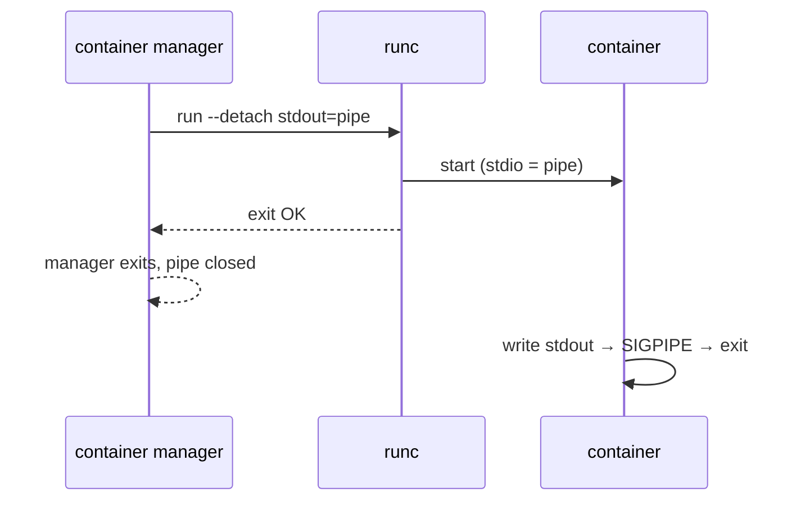

# 3. What runc does

[runc](https://github.com/opencontainers/runc) is the reference **OCI runtime**: a command-line tool that turns a **bundle** into a running, isolated process on Linux. [Chapter 2](02-oci-runtime-spec.md) defines bundles and the runtime spec; this chapter focuses on how runc *runs* them and why that design forces shims to exist.

**Recommended external read:** [Implementing Container Runtime Shim: runc](https://iximiuz.com/en/posts/implementing-container-runtime-shim/) (Ivan Velichko).

## OCI bundle

A bundle is a directory (see [chapter 2](02-oci-runtime-spec.md) for the full spec). At minimum:

| Path | Role |
|------|------|
| `config.json` | OCI runtime spec |
| `rootfs/` | Filesystem tree for `/` inside the container |

`runc spec` generates a default `config.json`. The runtime reads it, sets up namespaces and cgroups on the host, pivots root into `rootfs`, and execs the configured command.

## Foreground vs detached

| Mode | CLI | Long-lived `runc`? | Manager restart safe? | Typical use |
|------|-----|--------------------|-----------------------|-------------|
| **Foreground** | `runc run` | Yes — stays parent | No | Manual debugging |
| **Detached** | `runc run -d` or `create`+`start` | No | Yes (with shim) | containerd, CRI, kubelet |

## Foreground mode: runc stays in the middle

```bash
sudo runc run mycontainer
```

In **foreground** mode, a `runc` process remains between your shell and the container process. If you kill that `runc`, the container often dies (stdio breaks, SIGPIPE, etc.).


From inside the container, `echo $$` may print `1` even though `ps` on the host shows a different PID — that is the PID namespace at work.

**Tradeoff:** simple for manual debugging; bad for a container manager that must restart without killing workloads.

## Detached mode: runc exits, container keeps running

```bash
sudo runc run --detach mycontainer
```

In **detached** mode, `runc` sets everything up and exits. The container process is reparented (typically to PID 1 on the host). There is no long-lived `runc` in the tree.


Higher-level tools almost always use detached mode, often as two steps defined by OCI:

```bash
runc create mycontainer   # create container state, don't start user process yet
runc start mycontainer    # start user process
```

containerd’s Task API maps to **create** + **start** separately. CRI’s `crictl create` / `crictl start` follow the same split.

## The stdio trap (why naive “exec runc from Go” fails)

If a manager launches `runc run --detach` and holds a pipe to the container’s stdout, then **exits**, the pipe closes. The container may get **SIGPIPE** on the next write and exit — even though it was “detached.”



Velichko’s article demonstrates this with a tiny Go program that reads ten lines and quits; the container stops because stdio was tied to the manager’s lifetime.

**Lesson:** whoever owns the container’s stdio must live as long as the container (or redirect stdio to files/sockets that do). That owner is the **shim**, not containerd.

## runc is a CLI, not a library

Integrators usually `exec` the `runc` binary. Quark is similar for CLI paths (`quark create`, …) and for shim paths that call into in-process Rust rather than execing external runc — but the **contract** (bundle, lifecycle, signals) is OCI-shaped.

## How Quark differs at this layer

| runc | Quark |
|------|-------|
| Isolated process on **host** | Isolated process in **guest VM** (qkernel) |
| `runc` parent may stay in foreground | Host process is VMM + shim; guest runs workload |
| One container ↔ one host process tree | **Pod VM** model: one VM, many **subcontainers** inside guest (CRI) |

We still speak in OCI terms (`config.json`, hooks, cgroups on the **sandbox host process**), but execution crosses into the guest via **ucall** RPCs on a Unix socket.

## Next

[Chapter 4 — What a shim does](04-what-shim-does.md): the long-lived process that fixes stdio, exit codes, and manager restarts.
