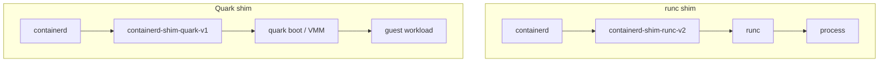
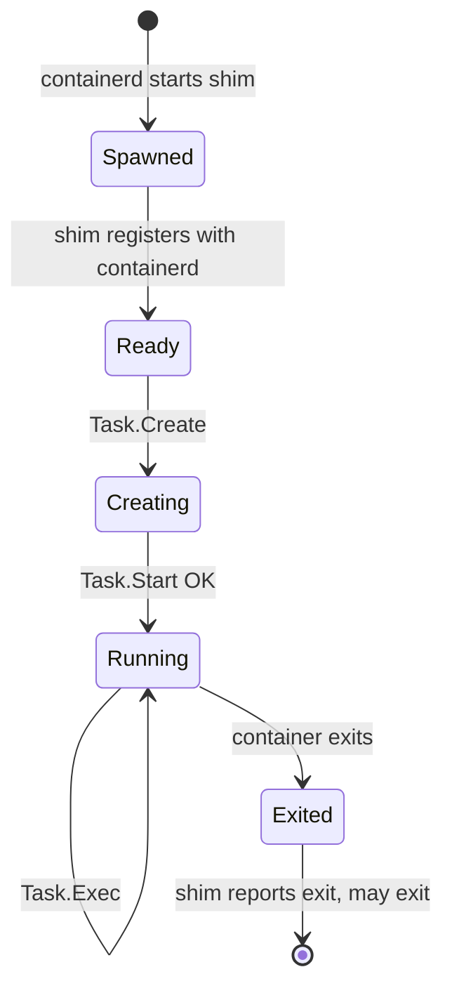

# 4. What a container runtime shim does

A **shim** is a small, long-lived process between the **container manager** (containerd) and the **OCI runtime** (runc, Quark, …). It exists because containerd must be restartable and must not hold pipes that would kill containers when it exits.

Again, [Velichko’s shim article](https://iximiuz.com/en/posts/implementing-container-runtime-shim/) is the best short treatment of the problem; this chapter aligns that story with what Quark implements.

## Spotting a shim on a live node

| Stack | Process tree (simplified) |
|-------|---------------------------|
| **Docker / runc** | `containerd` → `containerd-shim-runc-v2` → `runc` → your process |
| **Quark CRI** | `containerd` → `containerd-shim-quark-v1` → `quark boot` → guest workload |



The shim name prefix `containerd-shim-` is how containerd selects the plugin.

## Problems the shim solves

| # | Problem | Without shim | Shim fix |
|---|---------|--------------|----------|
| 1 | **Logs** | Lost when manager exits | Redirect stdio to files; survive containerd restart |
| 2 | **Attach** | No stable bridge for exec -it | Socket server → container stdio / PTY |
| 3 | **Exit code** | Detached runc parent gone | Subreaper waits, reports `TaskExit` |
| 4 | **Create errors** | stderr becomes container stderr | Consume create-phase errors before start |

### 1. Stdout, stderr, and stdin survive manager restarts

Logs are typically written to files under `/var/log/containers/` or similar. The shim keeps container IO plumbed to those sinks even if containerd restarts. That is what makes `kubectl logs` and `crictl logs` work days after the container started.

### 2. Attach and streaming

For `kubectl exec -it` or `crictl attach`, something must bridge client sockets to the container’s stdio (and often a PTY). The shim exposes that bridge; containerd forwards CRI streaming RPCs to it.

### 3. Exit status and reaping

In detached mode the low-level runtime may exit immediately after start. Something must **wait** on the container process, record exit code, and report **TaskExit** events to containerd. Shims often use **subreaper** (`PR_SET_CHILD_SUBREAPER`) so the container reparents to the shim, not host init.

### 4. Create/start synchronization

`runc create` can fail after partial setup. Errors may appear on stderr that later becomes the container’s stderr. The shim consumes that phase carefully and returns a clear error to containerd before the workload is considered running.

## Shim lifecycle (conceptual)



containerd **runtime v2** speaks **ttrpc** to the shim (`Task` service: `Create`, `Start`, `Delete`, `Kill`, `Exec`, `Wait`, `Stats`, …). Quark implements this in `qvisor/src/runc/shim/`.

## containerd-shim-runc-v2 vs Quark

| Aspect | runc v2 shim | Quark shim |
|--------|----------------|------------|
| Runtime | Execs `runc` | In-process Quark runtime (VM boot) |
| Process per container | Often one shim per container | CRI pod model: shim per **task** / sandbox pattern per containerd config |
| Isolation | Host namespaces | KVM + qkernel |
| Task API | Full surface | Partial — see [chapter 8](08-shim-task-api.md) |

## Quark’s shim code map

| File | Role |
|------|------|
| `qvisor/src/runc/shim/service.rs` | `Shim` trait: start/delete shim, create `ShimTask` |
| `qvisor/src/runc/shim/shim_task.rs` | `Task` trait: create/start/exec/kill/wait/stats/… |
| `qvisor/src/runc/shim/container.rs` | `ContainerFactory`, `CommonContainer` wrapper |
| `qvisor/src/runc/shim/process.rs` | Map ttrpc requests → `Container::Create1` |
| `qvisor/src/runc/shim/container_io.rs` | FIFOs, PTY, log forwarding |

Entry from containerd:

```text
argv0 = containerd-shim-quark-v1
  → main.rs → containerd_shim::run::<Service>(...)
```

## Next

[Chapter 5 — Quark binary entry](05-quark-binary-entry.md): how we choose CLI vs shim without a config flag.
