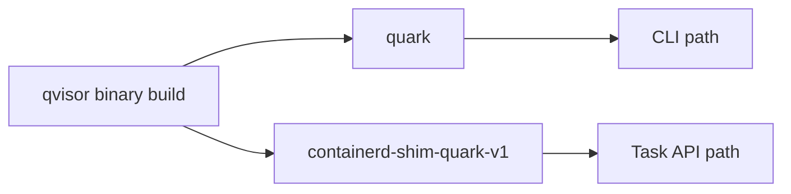
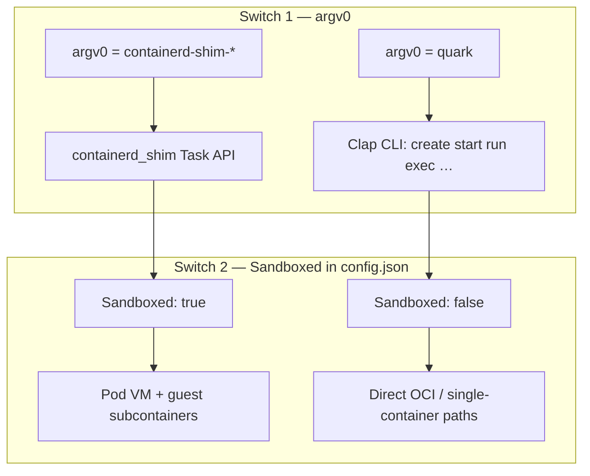

# 5. Quark binary entry: CLI, shim, and config

Quark ships **one binary** installed twice:

| Path on disk | Purpose |
|--------------|---------|
| `quark` | Operator CLI and direct OCI workflows |
| `containerd-shim-quark-v1` | containerd CRI / Task API |

`make install` copies the same build to both names (see root `makefile`).



## Two independent switches

Do not confuse **how the binary starts** with **how pods behave inside Quark**.



### Switch 1: argv0 (shim vs CLI)

Implemented in `qvisor/src/main.rs`:

```rust
fn invoked_as_containerd_shim() -> bool {
    // true when executable basename starts with "containerd-shim-"
}

if invoked_as_containerd_shim() && cmd != "boot" {
    containerd_shim::run::<Service>(...)
} else {
    Run(&mut args)  // normal CLI
}
```

- containerd always spawns the shim binary name → Task server.
- Operators run `quark list`, `quark run`, etc. → CLI never enters shim mode.
- **`boot` is special:** even under a shim-looking path, `quark boot` is the VM child entry used internally after `SandboxProcess` forks (see [chapter 6](06-quark-runc-internals.md)).

**Historical note:** an old `ShimMode: true` field in `config.json` could force shim behavior even for `quark list`. That was removed (bug [032](../../bugs/032-shimmode-hijacks-quark-cli.md)). Shim entry is **only** argv0 now.

### Switch 2: `Sandboxed` in `/etc/quark/config.json`

Defined in `qlib/config.rs` as `Config.Sandboxed`.

| Value | Typical use | Effect (simplified) |
|-------|-------------|---------------------|
| `false` | `quark run` on a dev machine | Host-side OCI; new VM only when spec says “root sandbox” |
| `true` | CRI / Kubernetes pods | Pod pause container boots VM; workloads are guest **subcontainers** |

CRI lab profile (`cri_bench_config_json()` in lab harness): `Sandboxed: true`, `EnableTsot: false`, `DisableCgroup: false`.

Other flags you will see alongside:

| Flag | CRI relevance |
|------|----------------|
| `DisableCgroup` | Must be `false` for cgroup v2 stats paths on lab |
| `EnableTsot` | Networking feature — separate from CRI lifecycle (Group B) |
| `ReserveCpuCount` | Host CPUs reserved when sizing guest vCPU count |

## Mental model for reviewers

- **“We use the shim in Rust”** → Yes. `containerd-shim-quark-v1` runs `containerd_shim::run` and `ShimTask`.
- **“We don’t use ShimMode config”** → Correct. Config does not select shim; argv0 does.
- **“Sandboxed turns on the shim”** → **No.** Sandboxed controls VM/pod semantics **inside** the runtime once you are already on a code path that creates containers.

## Verify on a node

```bash
# CLI must not enter shim
sudo quark list

# Shim binary name (manual smoke — real traffic comes from containerd)
ls -l $(which containerd-shim-quark-v1)
# often symlink or copy of same inode as quark
```

## Next

[Chapter 6 — Quark runc internals](06-quark-runc-internals.md): `qvisor/src/runc/` modules and the VM boundary.
