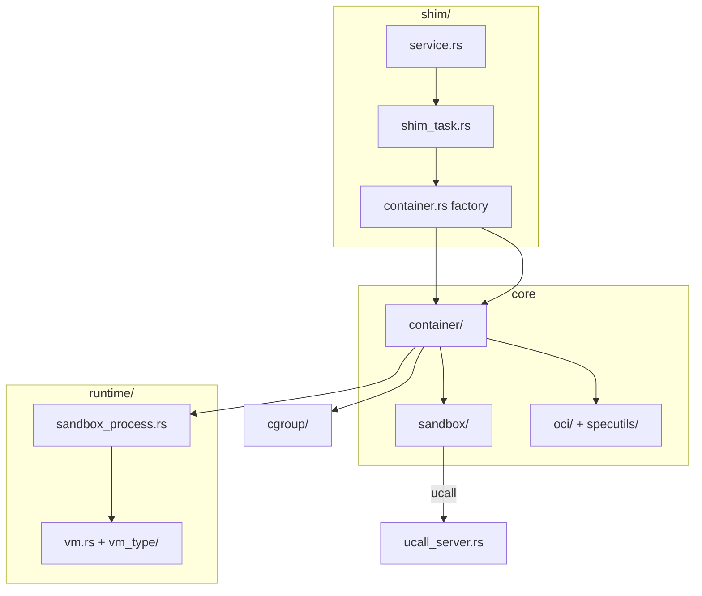
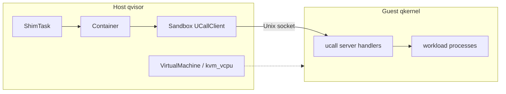
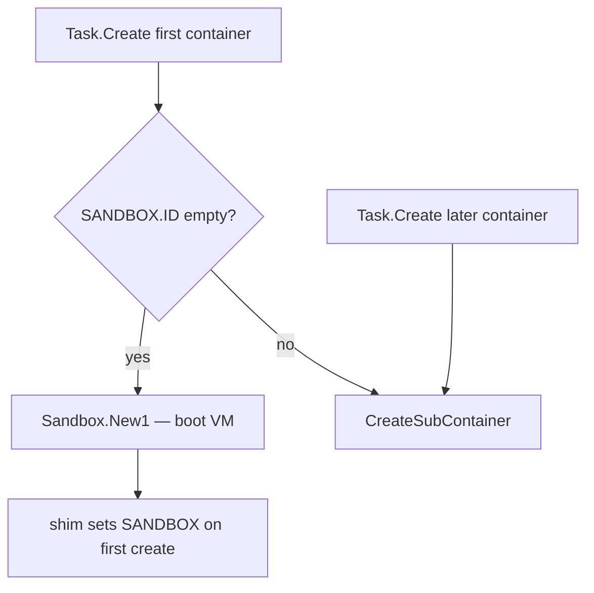

# 6. Quark “runc” internals

Quark’s `qvisor/src/runc/` tree is an **OCI-facing runtime** inherited from gVisor/railcar-style layout. It parses bundles, manages metadata on disk, and drives lifecycle — but execution happens in a **guest VM** (qkernel), not as a namespaced host process.

This chapter is the map a new engineer should read before debugging `crictl` failures.

## Directory layout

```
qvisor/src/runc/
  cmd/           CLI subcommands (run, create, start, exec, boot, sandbox, …)
  container/     Container state machine + persistence (meta.json)
  sandbox/       Host client to a running VM (ucall over Unix socket)
  shim/          containerd Task API (Service, ShimTask, IO)
  runtime/       Boot VM: SandboxProcess, VirtualMachine, vm_type/*
  cgroup/        Host cgroups v1/v2 + metrics for stats RPC
  oci/           OCI spec types
  specutils/     Annotations, ShouldCreateSandbox, helpers
```

Aggregator: `qvisor/src/runc/mod.rs`.

## Module dependency (simplified)



## Core types

### `Container` (`container/container.rs`)

The persistent record of one OCI container: bundle path, spec, status (`Created`, `Running`, `Stopped`), optional link to a `Sandbox`. Key methods:

- `Create` / `Create1` — create on disk (+ shim path uses `Create1`)
- `Start` — transition to running (ucall into guest)
- `Execute` — exec additional process
- `Destroy` / `Stop` — teardown

`Create1` is the shim entry; it understands **subcontainers** when `Sandboxed` and global `SANDBOX` state are set.

### `Sandbox` (`sandbox/sandbox.rs`)

Host-side handle to **one running micro-VM**. It is not the Kubernetes “pod sandbox” object by itself — it is our VM process plus a control socket. Methods include:

- `New1` — fork `quark boot`, boot KVM + qkernel
- `CreateSubContainer` — guest-side container create (ucall)
- `StartRootContainer` / `StartSubContainer` — start init or workload in guest
- `Exec1` — exec in guest
- `Destroy` / signal helpers

### `SandboxProcess` (`runtime/sandbox_process.rs`)

Serializable bootstrap state passed to the `boot` child: namespaces on host, pivot root, pipe to parent, optional **embedded task socket** for pod sandboxer mode. `Run()` loads `VirtualMachine` and blocks in the VMM.

### `VirtualMachine` (`runtime/vm.rs`)

KVM setup, load `qkernel.bin`, start vCPU threads, connect to `VMSpace` / `ShareSpace`.

### Shim types (`shim/`)

- **`Service`** — containerd `Shim` plugin: start shim process, wire publisher
- **`ShimTask`** — implements `Task` RPCs
- **`ContainerFactory::Create`** — build `CommonContainer` from `CreateTaskRequest`
- **`CommonContainer`** — shim wrapper around `Container` + init/exec processes

## Host ↔ guest control (ucall)

The guest kernel (or init path) serves a Unix socket protocol. Host `Sandbox` sends requests; guest handlers live under `qvisor/src/ucall/` (e.g. `RootContainerStart`, `CreateSubContainer`, `ExecProcess`).



This replaces “runc cloned namespaces on host” with “VMM runs guest; guest enforces isolation.”

## `Sandboxed` changes behavior (summary)

When `QUARK_CONFIG.Sandboxed == true`:



| # | Behavior | Detail |
|---|----------|--------|
| 1 | First container creates VM | `Sandbox::New1`, not subcontainer-only |
| 2 | Later containers share VM | `CreateSubContainer` when `SANDBOX.ID` set |
| 3 | Bundle path | Real path from containerd 2.x CRI ([031](../../bugs/031-cri-shim-bundle-path-containerd2.md)) |
| 4 | vCPU | Pause pod → 1 vCPU; bootstrap on vCPU 0 ([035](../../bugs/035-cri-pause-sandbox-vcpu-count.md)–[037](../../bugs/037-single-vcpu-uring-wait-deadlock.md)) |
| 5 | Pivot | Once per VM — `pivotOnce` ([038](../../bugs/038-cri-double-pivot-chdir-fail.md)) |

When `Sandboxed == false`, subcontainer CRI paths are not the normal operator workflow; CLI `create` targets root containers.

## CLI vs shim code paths

| Operation | CLI | Shim (containerd) |
|-----------|-----|-------------------|
| Create | `cmd/create.rs` → `Container::Create` | `ShimTask::create` → `Container::Create1` |
| Start | `cmd/start.rs` → `Container::Start` | `ShimTask::start` → `CommonContainer::start` |
| Exec | `cmd/exec.rs` → `Container::Execute` | `exec` + `start(exec_id)` two-step |
| Run (combined) | `cmd/run.rs` → `Container::Run` | N/A (CRI splits create/start) |

## How this differs from upstream runc

| Topic | runc | Quark |
|-------|------|-------|
| Isolation | Linux namespaces + cgroups on host | KVM VM + guest kernel |
| Processes per pod | Often one shim + one runc per container | **One VM per pod**, multiple guest containers |
| `boot` command | N/A | VMM child entry (`cmd/boot.rs`) |
| Cgroups | Applied to container process | Applied to **sandbox host process**; guest limits via loader |
| Confidential compute | N/A | `vm_type/emulcc.rs`, `sevsnp.rs` |

## Important files (quick index)

| File | One line |
|------|----------|
| `main.rs` | argv0 shim vs CLI |
| `cmd/command.rs` | CLI dispatch |
| `cmd/boot.rs` | VM child main |
| `container/container.rs` | Lifecycle + Sandboxed branching |
| `sandbox/sandbox.rs` | ucall client |
| `runtime/sandbox_process.rs` | Fork boot, stderr log, pivotOnce |
| `runtime/vm_type/noncc.rs` | Default VM; Sandboxed vCPU default |
| `shim/shim_task.rs` | Task API |
| `shim/container.rs` | Factory + metrics hook |
| `cgroup/cgroup.rs` | v2 unified install |
| `ucall/ucall_server.rs` | Guest RPC handlers |
| `qlib/config.rs` | `Sandboxed`, feature flags |

## Next

[Chapter 7 — CRI pod lifecycle](07-cri-pod-lifecycle.md): `runp`, pause, workloads, exec — end to end.
