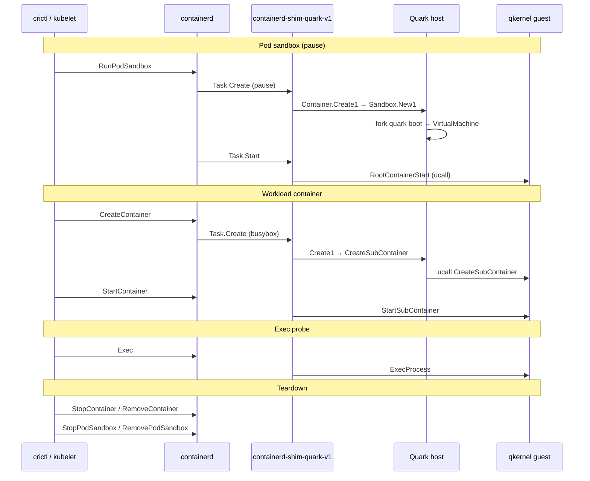
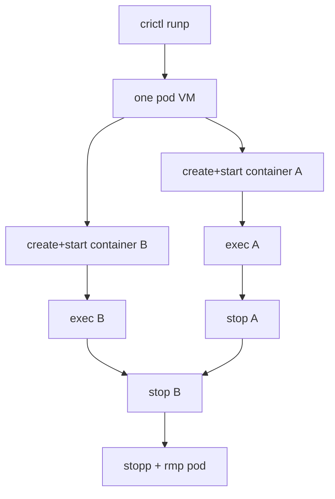

# 7. CRI pod lifecycle in Quark

This chapter walks through what happens when you run the same checks as our lab gate **L2**: pod sandbox, workload container, exec, teardown — using `crictl` against containerd with the `quark` runtime handler.

Lab scripts: `lab/src/keska_lab/cri/lifecycle.py`. Install: [`doc/k8s_setup.md`](../../../doc/k8s_setup.md).

## Prerequisites on the node

- containerd configured with `io.containerd.quark.v1` runtime and `sandboxer = "podsandbox"` (containerd 2.x)
- `containerd-shim-quark-v1` on `PATH`
- `/etc/quark/config.json` with **`Sandboxed: true`** for CRI pods
- Images pulled (pause, busybox, …)

## CRI objects vs OCI bundles

| CRI / crictl | OCI / Quark |
|--------------|-------------|
| Pod sandbox (`runp`) | Pause container spec + pod metadata; first Task.Create that boots VM |
| Container (`create` + `start`) | Workload bundle under `/run/containerd/...` |
| `exec` | Guest exec via ucall |
| Pod network / IPC | Configured by CRI; Quark consumes resulting spec |

Modern crictl does **not** use `crictl run` after `runp` for separate workload JSON — it uses **`create` then `start`** with the pod ID (lab harness accommodation **H4** — correct API usage, not a Quark workaround).

## crictl → Task API → Quark (L2 gate)

| Step | crictl | CRI / containerd | Shim Task RPC | Quark function |
|------|--------|------------------|---------------|----------------|
| 1 | `runp pod.json` | `RunPodSandbox` | `Create` + `Start` (pause) | `Create1` → `Sandbox::New1` → `StartRootContainer` |
| 2 | `create … pod` | `CreateContainer` | `Create` | `Create1` → `CreateSubContainer` |
| 3 | `start <cid>` | `StartContainer` | `Start` | `StartSubContainer` |
| 4 | `exec <cid> …` | `Exec` | `Exec` + `Start(exec_id)` | `Exec1` |
| 5 | `stop` / `rm` | `StopContainer` / `RemoveContainer` | `Kill` / `Delete` | `Stop` / `Destroy` |
| 6 | `stopp` / `rmp` | `StopPodSandbox` / `RemovePodSandbox` | pod teardown | VM destroy on root stop |

## End-to-end sequence



## Step by step (with code anchors)

### 1. `crictl runp pod.json` — pod sandbox

containerd starts (or reuses) a shim and calls **Task.Create** for the pause container.

1. `ShimTask::create` (`shim/shim_task.rs`)
2. `ContainerFactory::Create` — bundle from request; if `Sandboxed && req.bundle.is_empty()` use `/{id}` else containerd’s path
3. `Container::Create1` — because `SANDBOX.ID` is empty, take **VM create** branch (`IsRoot || Sandboxed`)
4. `Sandbox::New1` → `SandboxProcess::Execv1` → child runs `quark boot`
5. First create in empty map → set global `SANDBOX` (ID, Pid, Cgroup)
6. **Task.Start** → `Container::Start` → `StartRootContainer` ucall

Failure modes fixed in Group A: no VM (033), wrong vCPU count (035–037), double pivot (038).

### 2. `crictl create` + `crictl start` — workload

1. Task.Create with real bundle path under `/run/containerd/io.containerd.runtime.v2/task/...`
2. `Create1` sees `SANDBOX.ID` set → `CreateSubContainer` (not a second VM)
3. Task.Start → `StartSubContainer` — mount guest rootfs at `/{id}` (039)

### 3. `crictl exec`

containerd protocol:

1. **Task.Exec** — register exec process, emit `TaskExecAdded`
2. **Task.Start** with `exec_id` — `Sandbox::Exec1` → guest handler

CLI equivalent: `quark exec` → `Container::Execute`.

### 4. Stop and remove

- Stop workload: Task.Kill/Stop → guest teardown; subcontainer stop keeps sandbox ref (043)
- Stop pod: destroys VM sandbox when root container stops

**Harness accommodation H1:** lab uses `crictl stop -t N` before `rm` because zero-grace StopContainer can deadline; runtime follow-up tracked in bugs/backlog.

**Harness accommodation H3:** L5 multi-container test uses `wait_stopped` poll between sequential stops.

## Multi-container pods (L5)

Two workloads in one pod share **one VM** and one `SANDBOX`:



| Step | Command |
|------|---------|
| 1 | `runp` once |
| 2 | `create` + `start` for container A |
| 3 | `create` + `start` for container B |
| 4 | `exec` in each |
| 5 | Stop A, stop B, `stopp` / `rmp` pod |

Exercises subcontainer paths and stop ordering (043).

## Parity testing (Kata)

Lab command `keska-lab-cri-gate --parity --layer L5` runs the **same scripts** with `--runtime=kata` vs default Quark. Kata needs devmapper snapshotter setup on the lab host; Quark uses overlayfs path. L3 stats checks differ: Kata must show memory in JSON; Quark currently id-only in stats RPC (accommodation H2).

## Validation commands

```bash
# On lab host (after install)
keska-lab-cri-gate --runtime quark --layer L5
keska-lab-cri-gate --parity --layer L5

# Local contract tests (no SSH)
cd lab && pytest tests/test_cri_gate.py -v
```

Per-bug revert proof: `keska-lab-cri-bisect --bug 033` (see bug docs 031–043).

## What “green” does and does not mean

**Does mean:** pod sandbox + subcontainer lifecycle works on lab containerd; documented accommodations are explicit.

**Does not mean:** full kubelet production sign-off, complete Task API (see [chapter 8](08-shim-task-api.md)), or TSOT networking.

## Next

[Chapter 8 — Shim Task API](08-shim-task-api.md): RPC coverage and backlog.
