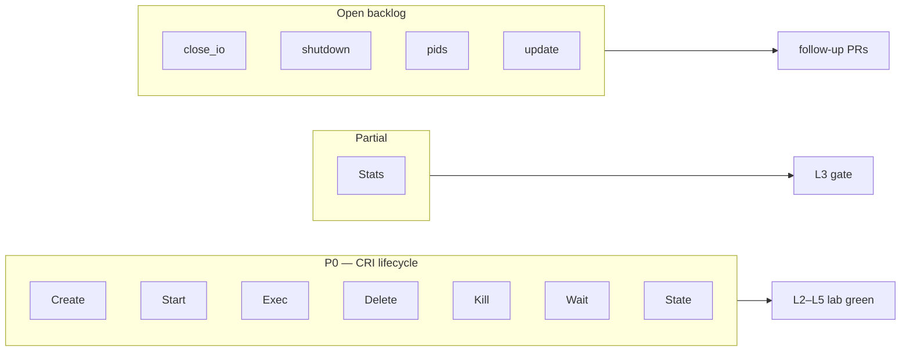

# 8. Shim Task API — coverage and backlog

containerd runtime v2 talks to Quark through the **Task** gRPC/ttrpc service implemented by `ShimTask` in `qvisor/src/runc/shim/shim_task.rs`. Group A (CRI lifecycle bugs 031–039, 043) focused on **create / start / exec / delete / kill / wait** — enough for L2–L5 lab gates. Several RPCs remain partial or stubbed.

Reference: [containerd runtime v2 README](https://github.com/containerd/containerd/blob/main/runtime/v2/README.md).

## Coverage overview

## Implemented for CRI lifecycle (P0)

| RPC | Status | Notes |
|-----|--------|-------|
| `Create` | Done | `ContainerFactory::Create` → `Create1` |
| `Start` | Done | Init or exec via `exec_id` |
| `Delete` | Done | Teardown container |
| `Kill` | Done | Signal guest |
| `Exec` | Done | Two-phase with `Start(exec_id)` |
| `Wait` | Done | Exit events |
| `State` | Done | Real pid (043; removed hardcoded 123) |
| `Stats` | Partial | Cgroup reader on host; Quark JSON often id-only in crictl (H2) |

## Gaps (follow-up work)

| RPC | Location | Impact | Priority |
|-----|----------|--------|----------|
| `close_io` | `shim_task.rs` | Stub returns OK; some attach/teardown paths | P1 |
| `shutdown` | `shim_task.rs` | Incomplete shim exit edge cases | P1 |
| PTY close | `shim/container_io.rs` | Exec IO edge cases | P1 |
| `pids` | `shim/container.rs` | `Unimplemented`; ListContainerStats / debug | P2 |
| `update` | `shim/container.rs` | `Unimplemented`; live CPU/mem resize | P2 |
| `pause` / `resume` | Not on Task trait | Optional CRI features | P3 |
| `checkpoint` | Not implemented | Optional | defer |

Compare with **containerd-shim-runc-v2**, which implements the full Task surface for host runc.

## Config flags that affect shim behavior

| Flag | Role |
|------|------|
| `Sandboxed` | Pod VM + subcontainers — **primary CRI flag** |
| `DisableCgroup` | Skip cgroup install; breaks stats on v2 hosts if true |
| `EnableTsot` | Networking — out of CRI lifecycle scope |

**Removed:** `ShimMode` — shim entry is argv0 only ([032](../../bugs/032-shimmode-hijacks-quark-cli.md)).

Lab CRI profile: `Sandboxed: true`, `EnableTsot: false`, `DisableCgroup: false` (`lab/src/keska_lab/setup/quark_config.py`).

## Quark vs runc-shim architecture (reminder)

| | runc v2 shim | Quark |
|--|--------------|-------|
| Isolation | Host namespaces | Guest VM |
| Unit of sharing | One container per task typical | **One VM per pod**, many guest containers |
| Stats source | Container cgroup | Sandbox / container cgroup on host + future guest metrics |

## Bug ↔ gap index (Group A)

Detailed symptom/fix rows live in `kdoc/bugs/03*.md` and `043`. Summary:

| Bug | Gap |
|-----|-----|
| 032 | Shim entry vs CLI |
| 031 | containerd 2.x bundle path |
| 033 | Pause sandbox VM create |
| 034 | cgroup v2 install |
| 035–037 | Pause vCPU + guest bootstrap + io_uring wait |
| 038 | Double pivot |
| 039 | Subcontainer rootfs path |
| 043 | Subcontainer cgroup + stop sync |

## Open production items

From [`future-plans.md`](../../future-plans.md#cri--shim-follow-ups-post-group-a):

- **H2:** Implement shim `stats()` with CPU/memory visible in CRI JSON (partially addressed by cgroup reader; crictl display still weak on Quark)
- **H1:** Graceful StopContainer for `crictl rm -f` without lab timeouts

## Where to change code

| Concern | Files |
|---------|-------|
| New Task RPC | `shim/shim_task.rs`, `shim/container.rs` |
| Metrics | `shim/container.rs` `metrics()`, `cgroup/stats.rs` |
| IO / attach | `shim/container_io.rs` |
| Shim process lifetime | `shim/service.rs` |

When implementing a gap, add a short bug note in `kdoc/bugs/` and update this chapter after approval per [architecture-docs rule](../../../.cursor/rules/architecture-docs.mdc).
