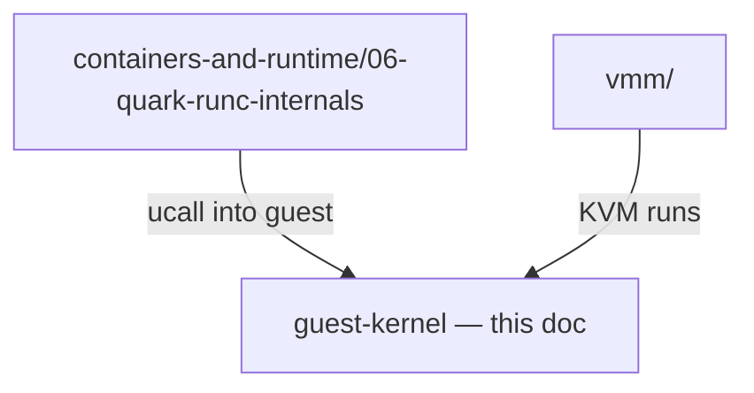

# Guest kernel (qkernel) — stub

> **Status:** Stub — full chapter not written yet.  
> **Code:** `qkernel/`, `qlib/kernel/`

## What this doc will cover

| Topic | Why it matters |
|-------|----------------|
| Guest boot sequence | vCPU 0/1 bootstrap, `InitLoader`, `ControllerProcess` |
| Scheduler & vCPUs | `taskMgr.rs`, `vcpu.rs`, single-vCPU CRI pause pods |
| Syscall surface | What Linux ABI qkernel implements vs stubs |
| Process / thread model | How container processes appear inside the guest |
| io_uring & host I/O | Guest waits, `IOWait`, interaction with `kvm_vcpu.rs` |
| Memory & pagetables | `ShareSpace`, guest/host shared mappings |

## Relationship to other docs

## Entry points to read today

| File | Role |
|------|------|
| `qkernel/src/lib.rs` | Guest main, bootstrap vCPU logic |
| `qlib/kernel/taskMgr.rs` | Scheduler, IOWait |
| `qlib/kernel/vcpu.rs` | Per-vCPU state machine |
| `qvisor/src/ucall/ucall_server.rs` | Host→guest RPC handlers |

## See also

- [CRI pod lifecycle](../containers-and-runtime/07-cri-pod-lifecycle.md) — symptoms when guest boot fails
- Bugs [035](../../bugs/035-cri-pause-sandbox-vcpu-count.md), [036](../../bugs/036-sandboxed-initloader-wait-tosearch-panic.md), [037](../../bugs/037-single-vcpu-uring-wait-deadlock.md)

---

*Approve expansion via [architecture-docs rule](../../../.cursor/rules/architecture-docs.mdc).*
