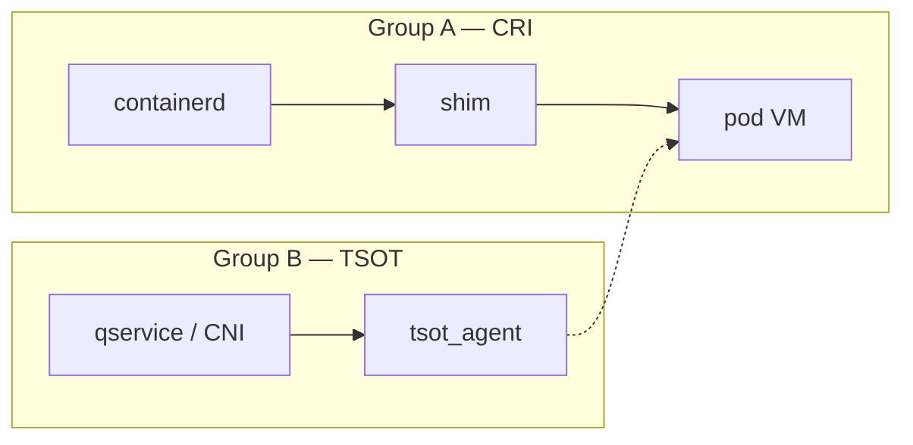

# Networking (TSOT) — stub

> **Status:** Stub — full chapter not written yet.  
> **Code:** `qservice/` (platform), `qvisor/src/vmspace/tsot_agent.rs`, config `EnableTsot`

## What this doc will cover

| Topic | Why it matters |
|-------|----------------|
| TSOT vs vanilla CRI networking | When `EnableTsot: true` changes the data path |
| Host agent & guest offload | `tsot_agent`, control messages in `vmspace` |
| CNI / K8s integration | qservice scheduler, gateway (platform build) |
| Group B scope | Explicitly **separate** from CRI lifecycle (Group A) |

## Config switch (preview)

| `EnableTsot` | Typical deployment |
|--------------|-------------------|
| `false` | CRI lab gates, baseline OCI/CRI |
| `true` | K8s platform path with TSOT CNI (separate proof chain) |

## Entry points to read today

| File | Role |
|------|------|
| `qvisor/src/vmspace/tsot_agent.rs` | Host TSOT agent |
| `qlib/config.rs` | `EnableTsot`, `PerSandboxLog` |
| `qservice/` | Node agent (not in minimal `make install`) |

## See also

- [Quark binary entry](../containers-and-runtime/05-quark-binary-entry.md) — `EnableTsot` flag table
- [`kdoc/group-a/README.md`](../../group-a/README.md) — TSOT was split from CRI diff

---

*Approve expansion via [architecture-docs rule](../../../.cursor/rules/architecture-docs.mdc).*
