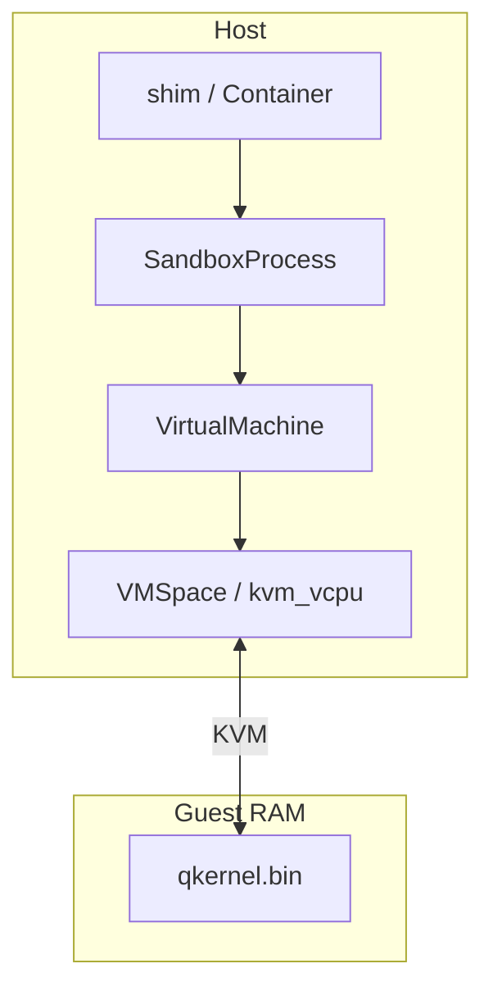

# Host VMM (vmspace) — stub

> **Status:** Stub — full chapter not written yet.  
> **Code:** `qvisor/src/vmspace/`, `qvisor/src/kvm_vcpu.rs`, `qvisor/src/runc/runtime/vm.rs`

## What this doc will cover

| Topic | Why it matters |
|-------|----------------|
| `VirtualMachine` vs `VMSpace` | Who owns KVM fd, guest RAM, vCPU threads |
| `ShareSpace` layout | Guest-visible memory, config, scheduler state |
| vCPU run loop | `kvm_vcpu.rs`, epoll, io_uring `ProcessOnce` |
| `pivotOnce` / rootfs | Host pivot before guest starts (bug 038) |
| Hibernate & snapshots | `vmspace/hibernate.rs` (if in scope) |
| Boot handoff | `SandboxProcess` → `quark boot` → `VirtualMachine::Init` |

## Stack placement

## Entry points to read today

| File | Role |
|------|------|
| `qvisor/src/runc/runtime/vm.rs` | VM create, kernel load |
| `qvisor/src/runc/runtime/sandbox_process.rs` | Fork boot, stderr log |
| `qvisor/src/vmspace/mod.rs` | VMSpace manager, pivot |
| `qvisor/src/kvm_vcpu.rs` | vCPU thread, I/O pump |

## See also

- [Quark runc internals](../containers-and-runtime/06-quark-runc-internals.md)
- [Guest kernel stub](../guest-kernel/README.md)

---

*Approve expansion via [architecture-docs rule](../../../.cursor/rules/architecture-docs.mdc).*
