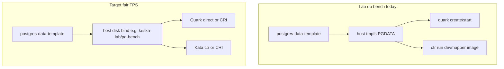

# Future plans

Living checklist for Quark production work and lab evolution. Replaces scattered roadmaps; details stay in [`kdoc/bugs/`](bugs/), [`kdoc/architecture/`](architecture/), and lab code.

---

## Baseline (done)

- [x] **Group A** — CRI/shim bring-up, cgroup v2-only, `keska-lab-cri-gate` L1–L5
- Docs: [`architecture/containers-and-runtime/`](architecture/containers-and-runtime/), bugs `031`–`044`

---

## Storage, disks, and benchmark fairness

Today the `db` suite copies warm PGDATA to **host tmpfs** on **both** Quark and Kata — TPS compares runtimes, not production-like block storage.

- [ ] **Fair `db` / `pgbench`** — PGDATA on host **disk** dir (pattern: `KESKA_LAB_IO_BENCH_DIR` in [lab/README.md](../lab/README.md)), not tmpfs, for both backends
- [ ] **`db-disk` suite mode** — same lifecycle, explicit storage profile (TTI may keep tmpfs; TPS uses disk)
- [ ] **CRI postgres bench** — `crictl` pod + workload container (does not auto-fix storage; Quark CRI defaults to overlayfs)
- [ ] **Quark + devmapper** (optional Kata parity) — `snapshotter = 'devmapper'` on quark runtime + pool health ([`kata_firecracker.py`](../lab/src/keska_lab/setup/kata_firecracker.py))
- [ ] **Production storage model** — PVC / emptyDir / bind mounts vs lab tmpfs; document overlayfs vs devmapper in OCI/CRI chapter
- [ ] **Guest I/O (P0)** — fadvise/readahead, fdatasync, vectored WAL ([`qkernel-linux-mechanisms-suggestions.md`](qkernel-linux-mechanisms-suggestions.md)); kernel work does not replace fair host storage
- [ ] **Devmapper ops** — ghost snapshots, pool busy, unpack fallbacks — bugs [`003`](bugs/003-devmapper-base-image-size.md), [`005`](bugs/005-devmapper-pool-busy.md), [`007`](bugs/007-postgres-devmapper-ghost-snapshots.md)

Harness refs: [`quark.py` `_postgres_run_bundle_script`](../lab/src/keska_lab/backends/quark.py), [`kata.py` `_postgres_data_prep_script`](../lab/src/keska_lab/backends/kata.py), bug [`004`](bugs/004-postgres-oci-pgbench.md).

---

## Group B — Networking / TSOT

Separate from CRI lifecycle (Group A). Stub: [`architecture/networking-tsot/`](architecture/networking-tsot/).

- [ ] Expand networking-tsot architecture chapter (approval gate per [architecture-docs rule](../.cursor/rules/architecture-docs.mdc))
- [ ] **`EnableTsot: false`** for CRI gates; **`true`** for platform/K8s path ([`05-quark-binary-entry.md`](architecture/containers-and-runtime/05-quark-binary-entry.md))
- [ ] Lab TSOT stack — `KESKA_LAB_ENABLE_TSOT=1`, [`setup/tsot.py`](../lab/src/keska_lab/setup/tsot.py), qservice `na`, etcd, `tsot` CNI
- [ ] **TSOT proof chain** — dedicated gate (e.g. `keska-lab-tsot-gate`), separate from CRI L1–L5
- [ ] Code map: [`qvisor/src/vmspace/tsot_agent.rs`](../qvisor/src/vmspace/tsot_agent.rs), `qservice/`, CNI integration
- [ ] Keep CRI and TSOT orthogonal — argv0 shim only; no config hijack (bug [`032`](bugs/032-shimmode-hijacks-quark-cli.md))

---

## CRI / shim follow-ups (post Group A)

From [`08-shim-task-api.md`](architecture/containers-and-runtime/08-shim-task-api.md):

- [ ] Shim `stats()` / `crictl stats` memory visibility (H2 partial)
- [ ] Graceful `StopContainer` / `crictl rm -f` without lab timeouts (H1)
- [ ] Remaining Task API gaps (pause, resize, checkpoint, …)

---

## Other forward work

- [ ] **Architecture stubs** (expand with approval): guest-kernel, vmm, confidential-compute
- [ ] **Experimental I/O (Group 5)** — `MmapRead` recommend delete ([`group5/e2-mmap-read-decision-packet.md`](group5/e2-mmap-read-decision-packet.md)); `UringStatx` resolve or delete; E1 deleted
- [x] **Containerd 2.x only** — drop `grpc.v1.cri` docs/probes; require shim bundle path ([`031`](bugs/031-cri-shim-bundle-path-containerd2.md))
- [ ] **Repo hygiene** — dead-code pass, install split, `qserverless/` out of scope
- [ ] **Lab evolution** — optional CRI-backed benchmarks for K8s parity; keep direct OCI for fast TTI regression

---

## Pointers

| Topic | Where |
|-------|-------|
| Architecture index | [`architecture/README.md`](architecture/README.md) |
| Bug fixes | [`bugs/`](bugs/) |
| Lab harness | [`lab/README.md`](../lab/README.md) |
| Guest I/O gaps | [`qkernel-linux-mechanisms-suggestions.md`](qkernel-linux-mechanisms-suggestions.md) |
| Group 5 decisions | [`group5/`](group5/) |
| K8s install | [`doc/k8s_setup.md`](../doc/k8s_setup.md) |
