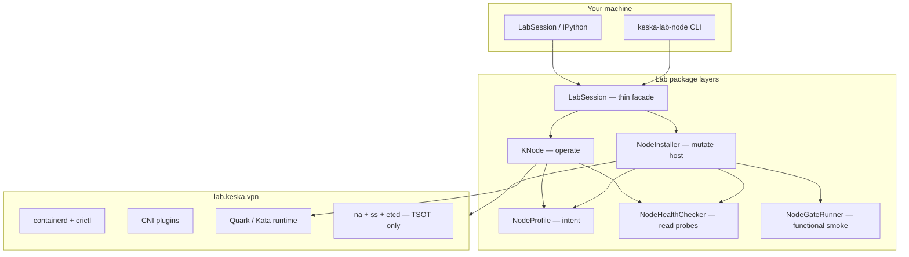
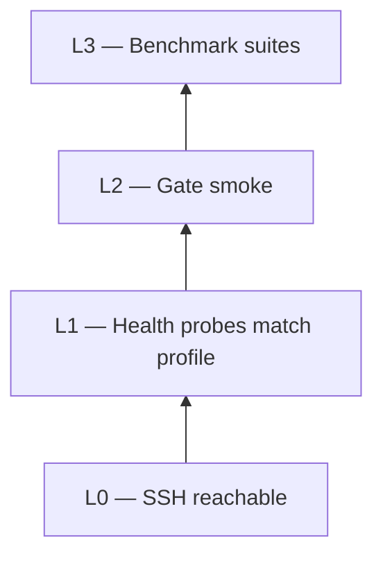
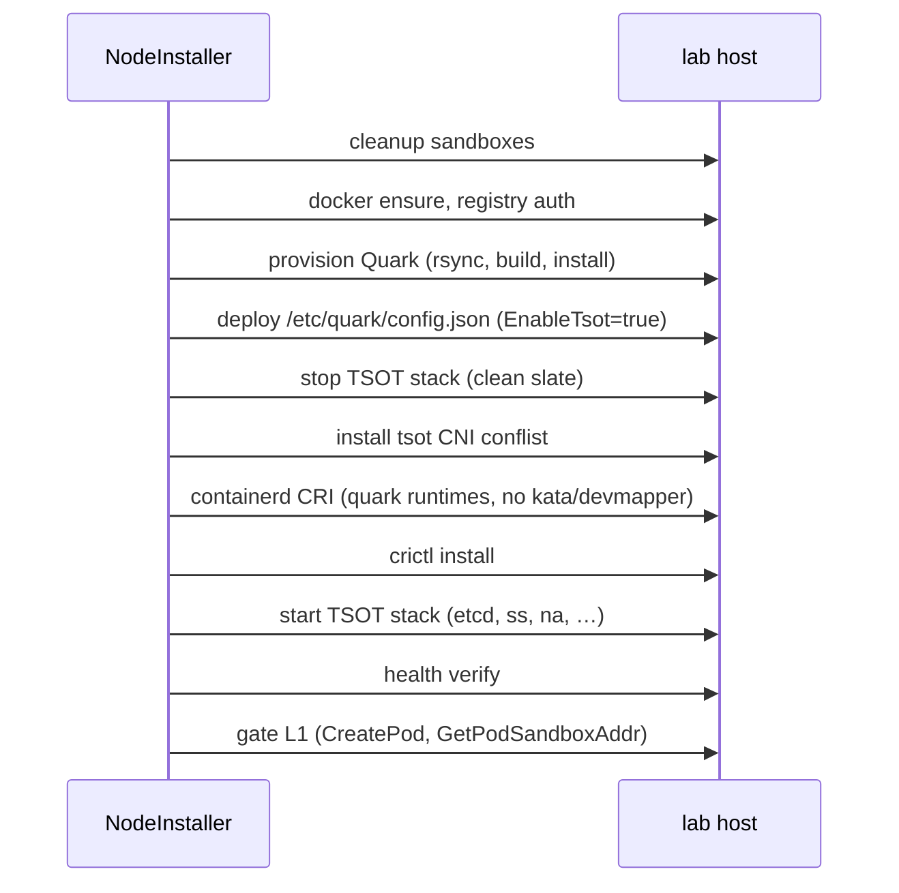

# Keska Lab — architecture

The lab package (`lab/src/keska_lab/`) is a **remote host controller**: it SSHs to a single x86_64 machine, runs idempotent setup pipelines, checks health, runs gates, and drives benchmarks. It is not a cluster manager — it models **one node** that happens to run picoVMs through Quark or Kata.

Design goal: replace ad-hoc env vars (`KESKA_LAB_ENABLE_TSOT`) and scattered `if enable_tsot` branches with a **layered, profile-driven** flow that matches how we actually work — configure host → install → use node → teardown → reconfigure.

---

## Layer stack



| Layer | Module | Responsibility |
|-------|--------|----------------|
| **Config** | `profile.py` | `NodeProfile`, `NetworkMode`, `NetworkParams` — frozen data, `validate()` |
| **Transport** | `remote.py`, `config.py` | SSH, rsync, `LabConfig.from_env()` |
| **Install** | `installer.py`, `setup/*` | `NodeInstaller.install()` / `cleanup()` — pipeline of `SetupStep`s |
| **Health** | `health.py` | Read-only probes; `mode_drift` detects CNI vs Quark config mismatch |
| **Gates** | `gate/*` | Post-install functional checks (bridge L1, TSOT L1) |
| **Ops** | `knode.py` | `KNode` — status, bench, teardown guard |
| **Session** | `session.py` | `LabSession.install()`, legacy `quark`/`kata` accessors |
| **Benchmarks** | `harness/*`, `backends/*`, `runtime.py` | Timed suites (unchanged hot path) |

**Rule:** `NodeProfile` never SSHs. `NodeInstaller` mutates. `NodeHealthChecker` only reads. `KNode` assumes install already happened.

---

## NodeProfile

A profile is the **single source of truth** for host intent:

```python
NodeProfile.quark_bridge()   # Quark + bridge CNI
NodeProfile.quark_tsot()     # Quark + TSOT stack + tsot CNI
NodeProfile.kata_bridge()    # Kata/Firecracker + bridge CNI
```

Fields that matter:

- `runtime` — `quark` or `kata`
- `network` — `bridge`, `tsot`, or `rdma` (stub)
- `build_profile` — `release` / `debug` for Quark binary name
- `net_params` — TSOT ports, CIDR, node IP (used by qlet config and gates)

Validation enforces **TSOT requires Quark** — Kata + TSOT is rejected at profile construction, not deep in a pipeline.

`LabConfig.network_mode` and the deprecated `enable_tsot` property are compatibility shims; new code should construct or select `NodeProfile` explicitly.

---

## Verification pyramid

Install succeeds only when each tier passes (unless explicitly skipped):



| Tier | When | What |
|------|------|------|
| **L0** | Always | SSH, basic command execution |
| **L1 health** | End of `install`, `verify`, `status` | containerd, crictl, CNI type, Quark config, TSOT services, `mode_drift` |
| **L2 gate** | End of full `install` (not `--network-only`) | `base_l1`: crictl info; `bridge_l1` or `tsot_l1` by profile |
| **L3** | Manual / CI | Harness suites (`light`, `network`, `db`, …) |

`--network-only` runs a **scoped L1** (network + TSOT probes, no containerd/crictl) and skips gates — useful when CRI is healthy but TSOT or Quark config drifted.

---

## Install pipeline

`NodeInstaller._install_pipeline()` builds a `SetupPipeline` from the profile and `InstallOptions`.

### Full install (example: `quark_tsot`)



### Ordering constraints (why the sequence matters)

1. **containerd before TSOT stack** — `containerd_cri_config_script` restarts containerd. If `na` is already running, it loses CRI and exits. TSOT stack must start **after** CRI is stable.

2. **TSOT lifecycle smoke deferred** — For `quark_tsot`, `ContainerdCriStep` skips RunPodSandbox lifecycle smoke (tsot CNI needs `na`). Bridge profiles run full CRI smoke. TSOT pod creation is validated in `tsot_l1` gate instead.

3. **Quark CRI stats skipped for TSOT** — `QuarkCriStatsStep` creates sandboxes; deferred for TSOT profiles for the same reason.

4. **Quark-only containerd config** — Kata/devmapper snapshotter is only added when `include_kata=True`. Adding devmapper on a Quark-only host breaks the CRI plugin (missing pool).

5. **etcd before ss** — State service (`ss`) registers with etcd; `ss_start_script` waits for etcd health before launching.

6. **No install while VMs running** — `NodeBusy` guard prevents changing CNI/TSOT under live sandboxes.

### Network-only install

Subset: cleanup → Quark config → TSOT stop → CNI → crictl config → TSOT stack. Skips provision, containerd, docker, gates.

---

## TSOT stack (lab host)

When `network == tsot`, `TsotStackStep` (`setup/tsot.py`) deploys:

| Component | Role |
|-----------|------|
| `/etc/quark/config.json` | `EnableTsot: true` |
| `/etc/quark/lab-qlet.json` | Single-node qlet config (ports, CIDR, etcd) |
| **etcd** (docker) | State backing store |
| **ss** | State service on `:8890` |
| **na** | Node agent — CreatePod on `:8888`, tsot socket |
| **tsot CNI** | Plugin binary at `/opt/cni/bin/tsot`, conflist type `tsot` |
| **grpcurl** | Gate and harness CreatePod calls |

Cleanup (`TsotStackStopStep` + `cleanup()`) stops na/ss/etcd and, on full cleanup, reverts CNI conflist to bridge.

Platform TSOT docs (relay, multi-node, scheduler) belong in [`kdoc/architecture/networking-tsot/`](../architecture/networking-tsot/) when expanded. The lab stack is **single-node, lab-qlet, singleNodeModel** — enough to bench and gate, not production topology.

---

## Gates

`NodeGateRunner` (`gate/runner.py`):

| Gate | Profile | Proves |
|------|---------|--------|
| `base_l1` | all | `crictl info` |
| `bridge_l1` | bridge | crictl runp → create → start → exec → teardown |
| `tsot_l1` | tsot | grpcurl CreatePod → GetPodSandboxAddr (UID pre-registration path) |

TSOT L1 uses a minimal `PodDef` JSON (`gate/tsot_gate.py`) compatible with `qservice/qshare` serde shapes. Network benchmarks that use crictl with TSOT must **CreatePod before CNI ADD** — same platform contract documented in TSOT flow maps under `tmp/tsot-flow-map/`.

---

## KNode operations

`KNode` is the **vSphere-like handle** after install:

- `status()` / `verify()` — aggregate health + running pod count
- `running_vms()` — Ready crictl pods
- `teardown_all()` — stop/remove all sandboxes (required before profile change)
- `bench(suite)` — delegates to `QuarkEnvironment` or `KataEnvironment` with `setup=False`

Bench setup pipelines in `setup/pipelines.py` remain for legacy `lab.quark.bench(..., setup=True)` but new workflow should install once via profile.

---

## Legacy vs new paths

| Concern | Legacy | Preferred |
|---------|--------|-----------|
| Enable TSOT | `KESKA_LAB_ENABLE_TSOT=1` | `NodeProfile.quark_tsot()` or `KESKA_LAB_NETWORK_MODE=tsot` |
| Host setup | Scattered pipeline `if enable_tsot` | `lab.install()` / `keska-lab-node install --profile …` |
| Network benches | `lab.quark.bench("network", setup=True)` | `lab.install()` then `node.bench("network")` |
| Check host | Manual ssh | `keska-lab-node verify` / `status` |

Legacy branches were removed from install pipelines; only `LabConfig.enable_tsot` property remains as a read compat shim.

---

## Code map

```
lab/src/keska_lab/
├── profile.py          NodeProfile, NetworkMode
├── config.py           LabConfig, env parsing
├── remote.py           SSH/rsync
├── installer.py        NodeInstaller, InstallOptions, pipelines
├── health.py           HealthReport, mode_drift
├── knode.py            KNode operational API
├── session.py          LabSession
├── node_cli.py         keska-lab-node entry point
├── gate/
│   ├── runner.py       NodeGateRunner
│   ├── bridge_gate.py  CRI lifecycle L1
│   └── tsot_gate.py    CreatePod / GetPodSandboxAddr L1
├── setup/
│   ├── base.py         SetupPipeline, SetupStep
│   ├── cni.py          CniPluginsStep (bridge vs tsot conflist)
│   ├── quark_config.py QuarkConfigStep, bench_config_json(profile)
│   ├── containerd_cri.py ContainerdCriStep (include_kata flag)
│   ├── tsot.py         TsotStackStep, na/ss/etcd scripts
│   └── pipelines.py    Legacy bench-ready pipelines
├── harness/            Benchmark suites (light, network, db, …)
├── backends/           QuarkBackend, KataBackend
└── runtime.py          QuarkEnvironment, KataEnvironment
```

Tests anchoring this design: `lab/tests/test_node_profile.py`, `test_node_installer.py`, `test_node_gates.py`.

---

## Extension guidelines

When adding a network mode, runtime, or setup step:

1. Extend `NetworkMode` / `NodeProfile.validate()` first.
2. Add setup steps; wire them in `NodeInstaller._install_pipeline()` behind profile checks — not env var branches.
3. Add health probes in `NodeHealthChecker` and, if functional, a gate in `gate/`.
4. Document the profile matrix in this file and usage examples in [usage.md](usage.md).
5. Keep **install idempotent** and **fail closed** (raise `InstallError` / `NodeBusy`, do not silently continue).

RDMA mode is reserved in `NetworkMode` but unimplemented — `validate()` rejects it until setup and gates exist.
